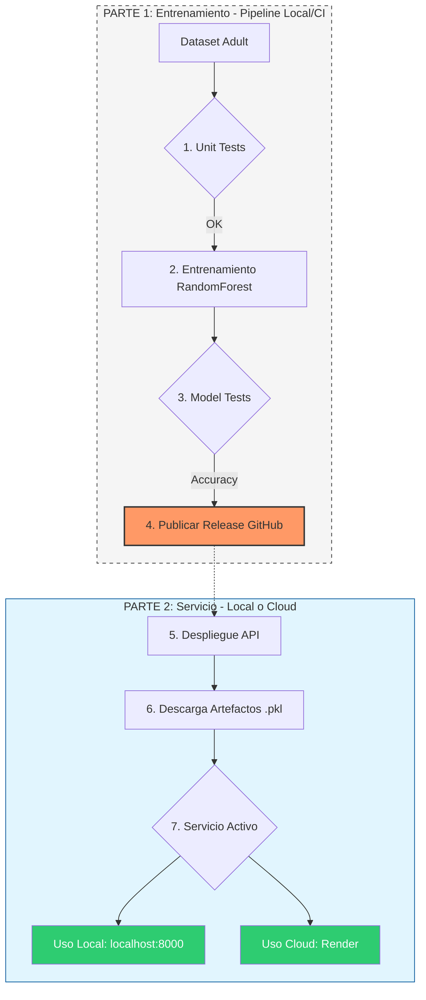

# MLOps Pipeline: Clasificación de Ingresos con RandomForest y Despliegue Automatizado

Este proyecto implementa un flujo completo de **MLOps** para la clasificación de ingresos utilizando el dataset **Census Income / Adult Dataset**. El sistema automatiza el ciclo de vida del modelo: ingesta de datos, preprocesamiento, entrenamiento con **RandomForest**, validación mediante tests, registro de artefactos en **GitHub Releases** y despliegue de una **API REST** en Render.

El repositorio está dividido en dos bloques principales:

- **Pipeline de entrenamiento**: genera, valida y registra los artefactos del modelo.
- **Servicio de inferencia**: expone una API con FastAPI que consume los artefactos entrenados y permite realizar predicciones.

El proyecto incorpora prácticas de DevOps como integración continua, build automatizado, despliegue continuo, protección de ramas, Pull Requests con revisión, uso de secretos, Render Blueprint como Infrastructure as Code y documentación de incidencias.

---

## Tabla de contenido

- [Integrantes del proyecto](#integrantes-del-proyecto)
- [Reparto de tareas](#reparto-de-tareas)
- [Repositorio](#repositorio)
- [Stack tecnológico](#stack-tecnológico)
- [Estructura del proyecto](#estructura-del-proyecto)
- [Arquitectura general](#arquitectura-general)
- [Flujo CI/CD](#flujo-cicd)
- [Pipelines de GitHub Actions](#pipelines-de-github-actions)
- [Protección de la rama main](#protección-de-la-rama-main)
- [Instalación local](#instalación-local)
- [Entrenamiento local del modelo](#entrenamiento-local-del-modelo)
- [Ejecución local de la API](#ejecución-local-de-la-api)
- [Documentación de la API](#documentación-de-la-api)
- [Ejemplos de uso de la API](#ejemplos-de-uso-de-la-api)
- [Despliegue en Render](#despliegue-en-render)
- [Infrastructure as Code con Render Blueprint](#infrastructure-as-code-con-render-blueprint)
- [Gestión de secretos y variables](#gestión-de-secretos-y-variables)
- [Pull Requests y Code Review](#pull-requests-y-code-review)
- [Rollback](#rollback)
- [Evidencias](#evidencias)
- [Problemas encontrados](#problemas-encontrados)
- [Estado actual de entrega](#estado-actual-de-entrega)
- [Referencias y licencia](#referencias-y-licencia)

---

## Integrantes del proyecto

- Alejandro Aguado
- Victor Méndez
- David Baos
- Lucía Mateo

---

## Reparto de tareas

| Integrante | Responsabilidad principal |
| --- | --- |
| Alejandro Aguado | README y documentación general del repositorio |
| Lucía Mateo | Documentación de API, validaciones y endpoints |
| Victor Méndez | Configuración y despliegue en Render |
| David Baos | Pull Requests, reviews y flujo de integración |

Este reparto es orientativo al final para agilizar el proyecto, todos hemos tocado en todo.  

---

## Repositorio

Repositorio del proyecto:

```text
https://github.com/Iber1to/pontia-mlops-evaluacion-grupo3
```

---

## Stack tecnológico

| Área | Tecnología |
| --- | --- |
| Lenguaje | Python 3.10 |
| Machine Learning | scikit-learn, pandas, joblib |
| Modelo | RandomForestClassifier |
| API | FastAPI |
| Servidor ASGI | Uvicorn |
| Validación de datos | Pydantic |
| Testing | Pytest |
| CI/CD | GitHub Actions |
| Registro de artefactos | GitHub Releases |
| Despliegue | Render |
| IaC | Render Blueprint mediante `render.yml` |

---

## Estructura del proyecto

```text
.
├── .github/
│   └── workflows/
│       ├── integration.yml
│       ├── build.yml
│       └── deploy.yml
│
├── data/
│   └── raw/
│       ├── adult.data
│       └── adult.test
│
├── deployment/
│   ├── app/
│   │   └── main.py
│   └── requirements.txt
│
├── docs/
│   ├── Issues.md
|   ├── Rollback.md
│   └── evidencias/
│       ├── ruleset-main-protection.png
│       ├── actions-integration-green.png
│       ├── actions-build-green.png
│       ├── actions-deploy-green.png
│       ├── render-deployed.png
│       ├── api-docs-render.png
│       ├── api-metrics-render.png
│       ├── api-health-render.png
│       ├── pr-review-approve.png
│       └── pr-review-request-changes.png
│
├── model_tests/ --> tests
│   └── test_model.py
│
├── models/
│   ├── model.pkl
│   ├── scaler.pkl
│   └── encoders.pkl
│
├── src/
│   ├── data_loader.py
│   ├── evaluate.py
│   ├── main.py
│   └── model.py
│
├── unit_tests/
│
├── .gitignore
├── pytest.ini
├── README.md
├── render.yml
└── requirements.txt
```

### Descripción de carpetas principales

| Ruta | Descripción |
| --- | --- |
| `src/` | Código del pipeline de entrenamiento del modelo |
| `deployment/` | Código de la API de inferencia desplegada en Render |
| `model_tests/` | Tests específicos de validación del modelo entrenado |
| `unit_tests/` | Tests unitarios de componentes del proyecto |
| `models/` | Artefactos generados por el entrenamiento |
| `.github/workflows/` | Pipelines de GitHub Actions |
| `docs/` | Documentación complementaria, incidencias y evidencias |
| `render.yml` | Definición de infraestructura en Render mediante Blueprint |

---

## Arquitectura general

El proyecto diferencia claramente entre entrenamiento e inferencia.



---

## Flujo CI/CD

El despliegue no se lanza directamente desde los Pull Requests. Primero se valida el código mediante la pipeline de integración y una revisión manual. Tras el merge en `main`, se ejecuta `Build Model`; si este workflow finaliza correctamente, se dispara automáticamente `Deploy Model`, que invoca el deploy hook de Render.

El flujo de trabajo sigue una estrategia basada en ramas, Pull Requests, validación automática, revisión manual y despliegue controlado:

```text
feature branch
      ↓
Pull Request
      ↓
Integration pipeline
      ↓
Code Review
      ↓
Merge a main
      ↓
Build Model pipeline
      ↓
Registro de artefactos
      ↓
Deploy Model pipeline
      ↓
    Render
```

---

## Pipelines de GitHub Actions

El proyecto contiene tres workflows principales.

### 1. Integration

Archivo:

```text
.github/workflows/integration.yml
```

Objetivo:

- Ejecutar validaciones tempranas del proyecto.
- Comprobar que el código no rompe la integración.
- Servir como required status check para proteger la rama `main`.

Ejecución:

- Automática en Pull Requests.
- Manual mediante `workflow_dispatch`.

Required status check configurado:

```text
integrate
```

---

### 2. Build Model

Archivo:

```text
.github/workflows/build.yml
```

Objetivo:

- Preparar entorno Python 3.10.
- Instalar dependencias.
- Descargar dataset.
- Entrenar modelo.
- Ejecutar tests de modelo.
- Publicar artefactos.
- Registrar modelo en GitHub Releases.

Ejecución:

- Automática en cada push a `main`.
- Manual mediante `workflow_dispatch`.

Artefactos esperados:

```text
models/model.pkl
models/scaler.pkl
models/encoders.pkl
training.log
```

---

### 3. Deploy Model

Archivo:

```text
.github/workflows/deploy.yml
```

Objetivo:

- Ejecutar el despliegue del servicio en Render.
- Utilizar el deploy hook configurado como secreto.
- Validar el flujo de despliegue continuo.

Ejecución:

- Manual mediante `workflow_dispatch`.
- Automática cuando el workflow Build Model finaliza correctamente en main.

El despliegue automático se realiza mediante workflow_run, escuchando la finalización del workflow Build Model. De esta forma, el servicio no se despliega directamente desde un Pull Request, sino después de que los cambios hayan sido integrados en main, el modelo haya sido entrenado, los tests hayan pasado y los artefactos hayan sido registrados correctamente.

```text
Pull Request
      ↓
Integration
      ↓
Code Review
      ↓
Merge a main
      ↓
Build Model
      ↓
Deploy Model
      ↓
   Render
```

---

## Protección de la rama main

La rama `main` está protegida mediante un ruleset de GitHub.

Configuración aplicada:

```text
Target: main
Restrict deletions: activado
Block force pushes: activado
Require a pull request before merging: activado
Require status checks to pass: activado
Require branches to be up to date before merging: activado
Required status check: integrate
```

Esta configuración evita cambios directos no revisados sobre `main` y obliga a que los Pull Requests pasen por revisión y validación automática antes de integrarse.

Evidencia:

```text
docs/evidencias/ruleset-main-protection.png
```

---

## Instalación local

### 1. Clonar el repositorio

```bash
git clone git@github.com:Iber1to/pontia-mlops-evaluacion-grupo3.git
cd pontia-mlops-evaluacion-grupo3
```

### 2. Crear entorno virtual

Linux / Mac:

```bash
python -m venv .venv
source .venv/bin/activate
```

Windows PowerShell:

```powershell
python -m venv .venv
.venv\Scripts\activate
```

### 3. Instalar dependencias

```bash
pip install -r requirements.txt
```

---

## Entrenamiento local del modelo

Para entrenar el modelo localmente es necesario disponer del dataset Adult en:

```text
data/raw/adult.data
data/raw/adult.test
```

Los datos pueden descargarse desde el UCI Machine Learning Repository.

Ejecutar entrenamiento:

```bash
python src/main.py
```

Ejecutar tests:

```bash
pytest
```

Ejecutar tests del modelo:

```bash
pytest model_tests -v
```

Resultado esperado:

```text
models/model.pkl
models/scaler.pkl
models/encoders.pkl
```

---

## Ejecución local de la API

La API se encuentra en:

```text
deployment/app/main.py
```

Para ejecutarla localmente:

```bash
uvicorn deployment.app.main:app --reload
```

Por defecto estará disponible en:

```text
http://localhost:8000
```

Documentación interactiva:

```text
http://localhost:8000/docs
```

---

## Documentación de la API

La API expone endpoints para comprobar estado, realizar predicciones y consultar métricas básicas.

| Endpoint | Método | Descripción |
| --- | --- | --- |
| `/health` | GET | Comprueba que el servicio está activo |
| `/predict` | POST | Recibe datos tabulares y devuelve la predicción del modelo |
| `/metrics` | GET | Devuelve métricas básicas del servicio |
| `/docs` | GET | Documentación Swagger generada automáticamente |

La validación de datos se realiza con Pydantic. Si el payload no cumple con los tipos o campos esperados, la API devuelve:

```text
HTTP 422 Unprocessable Entity
```

---

## Ejemplos de uso de la API

### 1.Health check

```bash
curl http://localhost:8000/health
```

Respuesta esperada:

```json
{
  "status": "healthy"
}
```

---

### 2.Predicción

Endpoint:

```text
POST /predict
```

Ejemplo de payload:

```json
{
  "age": 39,
  "workclass": "State-gov",
  "fnlwgt": 77516,
  "education": "Bachelors",
  "education-num": 13,
  "marital-status": "Never-married",
  "occupation": "Adm-clerical",
  "relationship": "Not-in-family",
  "race": "White",
  "sex": "Male",
  "capital-gain": 2174,
  "capital-loss": 0,
  "hours-per-week": 40,
  "native-country": "United-States"
}
```

Ejemplo con `curl`:

```bash
curl -X POST "http://localhost:8000/predict" \
  -H "Content-Type: application/json" \
  -d '{
    "age": 39,
    "workclass": "State-gov",
    "fnlwgt": 77516,
    "education": "Bachelors",
    "education-num": 13,
    "marital-status": "Never-married",
    "occupation": "Adm-clerical",
    "relationship": "Not-in-family",
    "race": "White",
    "sex": "Male",
    "capital-gain": 2174,
    "capital-loss": 0,
    "hours-per-week": 40,
    "native-country": "United-States"
  }'
```

Respuesta esperada:

```json
{
  "prediction": ["<=50K"],
  "duration_seconds": 0.0123
}
```

---

### 3.Ejemplo de error 422

Payload inválido:

```json
{
  "age": "treinta y nueve"
}
```

Respuesta esperada:

```text
HTTP 422 Unprocessable Entity
```

Este comportamiento valida que la API controla errores de entrada y evita procesar datos incorrectos.

---

### 4.Métricas

```bash
curl http://localhost:8000/metrics
```

Respuesta esperada:

```text
total_predictions 1
```

---

## Despliegue en Render

La API se despliega en Render como Web Service.

Configuración esperada:

| Parámetro | Valor |
| --- | --- |
| Runtime | Python |
| Branch | main |
| Root Directory | deployment |
| Build Command | `pip install --upgrade pip && pip install -r deployment/requirements.txt` |
| Start Command | `uvicorn app.main:app --host 0.0.0.0 --port $PORT` |
| Port | $PORT |
| Plan | Free |

URL pública de Render:

```text
https://adult-income-api-3p8k.onrender.com
```

Endpoints en Render:

```text
https://adult-income-api-3p8k.onrender.com/health
https://adult-income-api-3p8k.onrender.com/docs
https://adult-income-api-3p8k.onrender.com/openapi.json
https://adult-income-api-3p8k.onrender.com/metrics
```

---

## Infrastructure as Code con Render Blueprint

El repositorio incluye un archivo:

```text
render.yml
```

Este archivo define la infraestructura necesaria para desplegar el servicio en Render mediante código. Esto evita depender únicamente de configuración manual desde la interfaz web.

El blueprint define:

- Nombre del servicio.
- Runtime Python.
- Región.
- Plan gratuito.
- Comando de build.
- Comando de arranque.
- Variables de entorno necesarias.

---

## Gestión de secretos y variables

### 1.Variables de entorno

La API necesita conocer el repositorio desde el que descargar los artefactos del modelo.

Variable:

```text
GITHUB_REPO=Iber1to/pontia-mlops-evaluacion-grupo3
```

En local puede configurarse en un archivo `.env`.

El archivo `.env` no debe subirse al repositorio.

---

### 2.Secretos de GitHub

Para el despliegue se configura el siguiente secreto en GitHub:

```text
RENDER_DEPLOY_HOOK
```

Este secreto contiene el deploy hook generado por Render. Se utiliza desde el workflow `deploy.yml` para lanzar el despliegue sin exponer información sensible en el repositorio.

---

## Pull Requests y Code Review

El proyecto utiliza Pull Requests para integrar cambios en `main`.

Flujo seguido:

```text
1. Crear rama feature/fix/docs.
2. Realizar cambios.
3. Abrir Pull Request contra main.
4. Ejecutar pipeline Integration.
5. Solicitar revisión a otro integrante.
6. Añadir review formal.
7. Aprobar con comentario: Looks good to me.
8. Merge a main.
```

Comentario utilizado para aprobación:

```text
Looks good to me
```

También se han usado revisiones con `Request changes` cuando se han detectado problemas, por ejemplo:

- Conflictos de merge en `requirements.txt`.
- Inconsistencias en el endpoint `/predict`.
- Diferencias entre el modelo de respuesta esperado y el body devuelto.

PRs realizados:

```text
PR #1 - Enhance project documentation and API validation details
https://github.com/Iber1to/pontia-mlops-evaluacion-grupo3/pull/1

PR #2 - Render blueprint for automated API deployment
https://github.com/Iber1to/pontia-mlops-evaluacion-grupo3/pull/2

PR #3 - docs: add issues log
https://github.com/Iber1to/pontia-mlops-evaluacion-grupo3/pull/3

PR #4 - ci: add manual trigger to build workflow
https://github.com/Iber1to/pontia-mlops-evaluacion-grupo3/pull/4

PR #5 - Trigger deployment after successful build
https://github.com/Iber1to/pontia-mlops-evaluacion-grupo3/pull/5

PR #6 - Fix model accuracy preprocessing and data loader warnings
https://github.com/Iber1to/pontia-mlops-evaluacion-grupo3/pull/6
```

---

## Evidencias

Las evidencias del proyecto se encuentran en:

```text
docs/evidencias/
```

Evidencias previstas:

| Evidencia | Archivo |
| --- | --- |
| Protección de rama main | `docs/evidencias/ruleset-main-protection.png` |
| Pipeline Integration en verde | `docs/evidencias/actions-integration-green.png` |
| Pipeline Build en verde | `docs/evidencias/actions-build-green.png` |
| Pipeline Deploy en verde | `docs/evidencias/actions-deploy-green.png` |
| Servicio Render desplegado | `docs/evidencias/render-deployed.png` |
| Swagger de la API | `docs/evidencias/api-docs-render.png` |
| Prueba de /predict | `docs/evidencias/api-metrics-render.png` |
| Prueba de salud API | `docs/evidencias/api-health-render.png` |
| Review con aprobación | `docs/evidencias/pr-review-approve.png` |
| Review con Request Changes | `docs/evidencias/pr-review-request-changes.png` |

---

## Rollback

Se puede consultar el procedimiento de Rollback desde:

```text
docs/Rollback.md
```

---

## Problemas encontrados

Durante el desarrollo se han documentado problemas técnicos y decisiones tomadas en:

```text
docs/Issues.md
```

Este archivo incluye, entre otros:

- Problema al añadir el required status check en GitHub Rulesets.
- Solución usando el job `integrate`.
- Conflicto de merge en `requirements.txt`.
- Error detectado en el endpoint `/predict`.
- Decisión de completar el README al final.
- Validación del flujo de Pull Requests y Code Review.

---

## Estado actual de entrega

| Requisito | Estado |
| --- | --- |
| Repositorio GitHub creado | Completado |
| Workflows de GitHub Actions | Completado |
| Pipeline Integration | Completado |
| Pipeline Build | Completado |
| Pipeline Deploy | Completado |
| Secrets configurados | Completado |
| Ruleset sobre `main` | Completado |
| Pull Requests con review | Completado |
| Render Blueprint | Completado |
| Servicio desplegado en Render | Completado |
| README completo | Completado |
| Rollback documentado | Completado |
| Evidencias | Completado |
| Issues documentados | Completado |

---

## Referencias y licencia

### Dataset

UCI Machine Learning Repository - Adult Dataset:

```text
https://archive.ics.uci.edu/dataset/2/adult
```

### Licencia

Este proyecto se entrega con fines académicos para la asignatura de Introducción a DevOps.

Licencia propuesta:

```text
MIT
```
