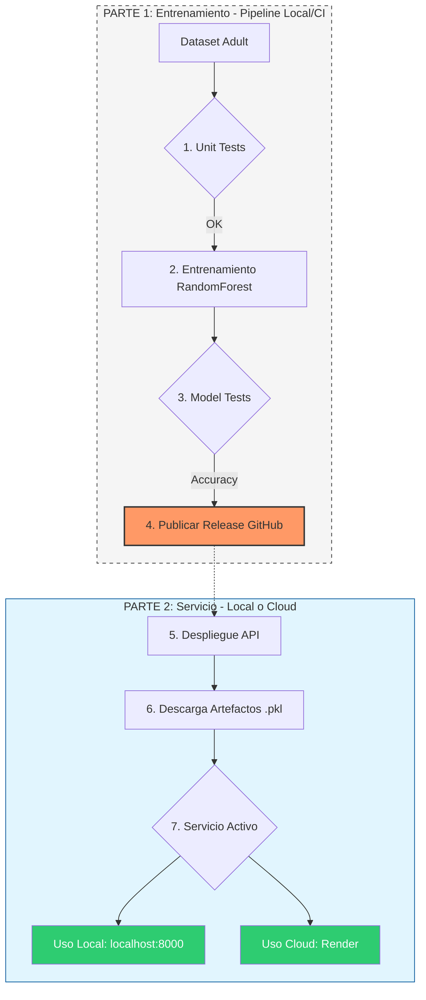

# MLOps Pipeline: Sistema de Clasificación con RandomForest y Despliegue Automatizado

Este proyecto implementa un ecosistema de **MLOps** para la clasificación de ingresos basada en el dataset Census Income (Adult). El sistema automatiza todo el ciclo de vida del modelo: desde la ingesta y preprocesamiento de datos tabulares, pasando por un pipeline de entrenamiento robusto con **RandomForest**, hasta el despliegue de una **API REST** escalable en la nube. La solución tiene un enfoque claro en la calidad del software, integrando validación de datos con Pydantic, pruebas automatizadas con Pytest y despliegue continuo mediante **Render Blueprints**.

El proyecto está dividido en dos partes independientes: un **Pipeline de Entrenamiento** (enfocado en la generación y validación de artefactos) y un **Servicio de Inferencia** (una API optimizada para producción que consume dichos artefactos).

## Tabla de contenido

- [Integrantes del proyecto](#integrantes-del-proyecto)
- [Requisitos y Stack Tecnológico](#requisitos-y-stack-tecnológico)
- [Funcionamiento del Sistema](#funcionamiento-del-sistema)
- [Estructura del Proyecto](#estructura-del-proyecto)
- [Arquitectura y Flujo de Trabajo (CI/CD)](#arquitectura-y-flujo-de-trabajo-cicd)
- [Instalación y Configuración](#instalación-y-configuración)
- [Ejecución y Despliegue](#ejecución-y-despliegue)
- [Documentación de la API](#documentación-de-la-api)
- [Referencias y Licencia](#referencias-y-licencia)

## Integrantes del proyecto
*   Alejandro Aguado
*   Victor Mendez
*   David Baos
*   Lucía Mateo

## Requisitos y Stack Tecnológico

### 1. Entorno de Ejecución
*   **Python 3.10**: Versión de referencia utilizada para el desarrollo y el despliegue en la nube.
*   **Configuración de Acceso**: Es imprescindible configurar la variable de entorno `GITHUB_REPO` para que la API pueda localizar y descargar los artefactos (`.pkl`) desde los Releases.

### 2. Stack Tecnológico (Librerías Principales)
*   **Machine Learning**: `scikit-learn` (RandomForest), `pandas` y `joblib`.
*   **Servicio Web**: `FastAPI` y `Uvicorn`.
*   **Validación de Datos**: `Pydantic`.
*   **Testing**: `Pytest` para validación de código y calidad del modelo.
*   **Infraestructura**: `Render` y `GitHub Releases`.

## Funcionamiento del Sistema

El proyecto opera en dos modos distintos según la necesidad:

### A. Parte de Entrenamiento (src/)
Se utiliza para generar el modelo desde cero. Requiere los datos en local y ejecuta las pruebas de calidad.
* **Comando:** `python src/main.py && pytest`
* **Resultado:** Genera archivos `.pkl` en la carpeta `models/` listos para ser publicados.

### B. Parte de Servicio (deployment/)
Es la API que utiliza el usuario final. No necesita entrenar ni tener los datos originales, ya que descarga el modelo pre-entrenado.
* **Comando:** `uvicorn deployment.app.main:app --reload`
* **Resultado:** Endpoint interactivo en `/docs` para realizar predicciones en tiempo real.

## Estructura del Proyecto
El código sigue una arquitectura modular, separando la lógica de entrenamiento, la infraestructura de despliegue y la validación de calidad en capas independientes:

* **`src/`**: Núcleo del proyecto que contiene la lógica de ciencia de datos.
    * **`data_loader.py`**: Funciones para la ingesta y preprocesamiento de los datos.
    * **`model.py`**: Definición, configuración e instanciación del modelo.
    * **`evaluate.py`**: Módulo de evaluación, muestra precision y clasificación.
    * **`main.py`**: Orquestador del pipeline; ejecuta el flujo completo desde la carga hasta el entrenamiento.
* **`deployment/`**: Infraestructura necesaria para servir el modelo en producción.
    * **`app/main.py`**: Punto de entrada de la **API**. Gestiona las peticiones y devuelve predicciones y metricas.
    * **`requirements.txt`**: Dependencias para el entorno de ejecución. Modelo ya entrenado asi que deben ser lo mas ligeras posibles.
* **`unit_tests/`**: Pruebas unitarias aisladas para garantizar que cada componentem funciona correctamente.
* **`model_tests/`**: Pruebas de validación del modelo entrenado, asegurando que el artefacto final cumple con los umbrales de calidad requeridos.
* **`models/`**: Carpeta donde se almacenan los artefactos entrenados (model.pkl, scaler.pkl, encoders.pkl) necesarios para realizar las predicciones.
* **`pytest.ini`**: Archivo de configuración para la automatización de la suite de pruebas con Pytest.
* **`requirements.txt`**: Listado completo de dependencias, necesarias tanto para desarrollo, entrenamiento y produccion.
* **`.env`**: Archivo de configuración local para variables de entorno (no incluido en el repo)
* **`.gitignore`**: Especificación de archivos excluidos del repositorio.


## Arquitectura y Flujo de Trabajo (CI/CD)

El proyecto asegura la integridad del modelo mediante el siguiente flujo:


1. **Validación de Código:** Ejecución de `unit_tests` para verificar la lógica de `src/`.
2. **Entrenamiento:** Generación del modelo mediante el pipeline principal.
3. **Validación de Modelo:** Los `model_tests` certifican la precisión del RandomForest antes de su liberación.
4. **Despliegue:** La carpeta `deployment/` toma el modelo validado para servirlo mediante una API.

## Instalación y Configuración

1. **Clonar el repositorio:**
   ```bash
   git clone git@github.com:Iber1to/pontia-mlops-evaluacion-grupo3.git
   ```
2. **Configurar el entorno virtual:**
   ```bash
   python -m venv .venv
   source .venv/bin/activate  # En Windows: .venv\Scripts\activate
   pip install -r requirements.txt
   ```
3. **Configuración de Variables de Entorno (.env):** Crea un archivo llamado `.env` en la raíz del proyecto para que la API pueda localizar tu repositorio de GitHub:
```text
GITHUB_REPO=usuario/nombre-del-repo
```
> **Nota:** Asegúrate de que el archivo `.env` esté incluido en tu `.gitignore` para no subir información sensible o específica de tu entorno. No olvides configurarlo manualmente en tu entorno local y en las "Environment Variables" de Render.

## Ejecución y Despliegue

### A. Parte de Entrenamiento (Local)
Para generar el modelo desde cero, se requieren los datos originales en `data/raw/`:
```bash
python src/main.py && pytest
```

### B. Parte de Servicio (Local o Cloud)
La API es agnóstica al entorno y no requiere los datos originales, ya que consume los artefactos de GitHub:
* **Local:** `uvicorn deployment.app.main:app --reload`
* **Cloud (Render):** El archivo `render.yaml` gestiona automáticamente el despliegue.

> **Nota sobre los datos**: Para ejecutar el entrenamiento localmente, asegúrate de descargar los archivos adult.data y adult.test del UCI Machine Learning Repository y colocarlos en la carpeta data/raw/.


## Documentación de la API
> Accede a la documentacion de la API aqui: `http://localhost:8000/docs` (una vez desplegada)

La API gestiona automáticamente el ciclo de vida de los artefactos. Al iniciar, descarga la versión más reciente del modelo (`model.pkl`), el escalador (`scaler.pkl`) y los encoders (`encoders.pkl`) directamente desde los **Releases de GitHub**.

La API utiliza Pydantic Schemas para validar automáticamente que los datos de entrada cumplen con los tipos requeridos. En caso de error, la API devolverá un código 422 Unprocessable Entity con el detalle del campo incorrecto.

### Endpoints Principales

| Endpoint | Método | Descripción |
| --- | --- | --- |
| /health | GET | Verifica que el servicio esté activo y listo. |
| /predict | POST | Procesa datos y devuelve la predicción del modelo. |
| /metrics | GET | Expone el conteo total de predicciones (PlainText). |
| /docs | GET | Documentación interactiva y pruebas en vivo (Swagger). |
> **Interactividad:** Puedes probar la API en vivo accediendo a `http://localhost:8000/docs` (Swagger UI) una vez desplegada.

## Referencias y Licencia
* **Dataset:** [UCI Machine Learning Repository - Adult Dataset](https://uci.edu).
* **Licencia:** Este proyecto está bajo la Licencia **MIT**.