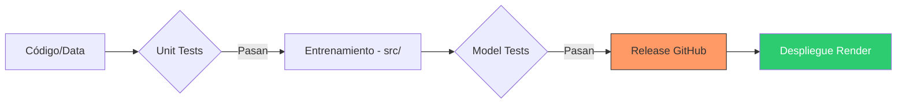

# MLOps Pipeline: Sistema de Clasificación con RandomForest y Despliegue Automatizado

Este proyecto implementa un ecosistema de **MLOps** para la clasificación de ingresos basada en el dataset Census Income (Adult). El sistema automatiza todo el ciclo de vida del modelo: desde la ingesta y preprocesamiento de datos tabulares, pasando por un pipeline de entrenamiento robusto con **RandomForest**, hasta el despliegue de una **API REST** escalable en la nube. La solución tiene un enfoque claro en la calidad del software, integrando validación de datos con Pydantic, pruebas automatizadas con Pytest y despliegue continuo mediante **Render Blueprints**.


## Tabla de contenedores

- [Estructura del Proyecto](#estructura-del-proyecto)
- [Ciclo de vida (CI/CD)](#ciclo-de-vida-cicd)
- [Instalación y Configuración](#instalación-y-configuración)
- [Ejecución y Despliegue](#ejecución-y-despliegue)
- [Documentación de la API](#documentación-de-la-api)

## Estructura del Proyecto
El código sigue una arquitectura modular, separando la lógica de entrenamiento, la infraestructura de despliegue y la validación de calidad en capas independientes:

* **`src/`**: Núcleo del proyecto que contiene la lógica de ciencia de datos.
    * **`data_loader.py`**: Funciones para la ingesta y preprocesamiento de los datos.
    * **`model.py`**: Definición, configuración e instanciación del modelo.
    * **`evaluate.py`**: Módulo de evaluación, muestra precision y clasificación.
    * **`main.py`**: Orquestador del pipeline; ejecuta el flujo completo desde la carga hasta el entrenamiento.
* **`deployment/`**: Infraestructura necesaria para servir el modelo en producción.
    * **`app/main.py`**: Punto de entrada de la **API**. Gestiona las peticiones y devuelve predicciones y metricas.
    * **`requirements.txt`**: Dependencias para el entorno de ejecución. Modelo ya entrenado asi que deben ser lo mas ligeras posibles.
* **`unit_tests/`**: Pruebas unitarias aisladas para garantizar que cada componentem funciona correctamente.
* **`model_tests/`**: Pruebas de validación del modelo entrenado, asegurando que el artefacto final cumple con los umbrales de calidad requeridos.
* **`models/`**: Carpeta donde se almacenan los artefactos entrenados (model.pkl, scaler.pkl, encoders.pkl) necesarios para realizar las predicciones.
* **`pytest.ini`**: Archivo de configuración para la automatización de la suite de pruebas con Pytest.
* **`requirements.txt`**: Listado completo de dependencias, necesarias tanto para desarrollo, entrenamiento y produccion.
* **`.env`**: Archivo de configuración local para variables de entorno (no incluido en el repo)
* **`.gitignore`**: Especificación de archivos excluidos del repositorio.


## Ciclo de Vida (CI/CD)

El proyecto asegura la integridad del modelo mediante el siguiente flujo:


1. **Validación de Código:** Ejecución de `unit_tests` para verificar la lógica de `src/`.
2. **Entrenamiento:** Generación del modelo mediante el pipeline principal.
3. **Validación de Modelo:** Los `model_tests` certifican la precisión del RandomForest antes de su liberación.
4. **Despliegue:** La carpeta `deployment/` toma el modelo validado para servirlo mediante una API.

## Instalación y Configuración

1. **Clonar el repositorio:**
   ```bash
   git clone git@github.com:Iber1to/pontia-mlops-evaluacion-grupo3.git
   ```
2. **Configurar el entorno virtual:**
   ```bash
   python -m venv .venv
   source .venv/bin/activate  # En Windows: .venv\Scripts\activate
   pip install -r requirements.txt
   ```
3. **Configuración de Variables de Entorno (.env):** Crea un archivo llamado `.env` en la raíz del proyecto para que la API pueda localizar tu repositorio de GitHub:
```text
GITHUB_REPO=usuario/nombre-del-repo
```
> **Nota:** Asegúrate de que el archivo `.env` esté incluido en tu `.gitignore` para no subir información sensible o específica de tu entorno. No olvides configurarlo manualmente en tu entorno local y en las "Environment Variables" de Render.

## Ejecución y Despliegue

### Despliegue Local
Para probar el pipeline o la API en tu máquina local:

1. **Instalar dependencias** (solo si no lo has hecho antes): `pip install -r requirements.txt`
2. **Entrenar y probar:** `python src/main.py && pytest`
3. **Levantar API:** `uvicorn deployment.app.main:app --reload`

### Despliegue en Render
Este proyecto utiliza **Infrastructure as Code (IaC)** mediante un archivo `render.yaml`. Esto permite un despliegue facil con toda la configuración predefinida.


## Documentación de la API
> Accede a la documentacion de la API aqui: `http://localhost:8000/docs` (una vez desplegada)

La API gestiona automáticamente el ciclo de vida de los artefactos. Al iniciar, descarga la versión más reciente del modelo (`model.pkl`), el escalador (`scaler.pkl`) y los encoders (`encoders.pkl`) directamente desde los **Releases de GitHub**.

### Endpoints Principales

| Endpoint | Método | Descripción |
| --- | --- | --- |
| /health | GET | Verifica que el servicio esté activo y listo. |
| /predict | POST | Procesa datos y devuelve la predicción del modelo. |
| /metrics | GET | Expone el conteo total de predicciones (PlainText). |
| /docs | GET | Documentación interactiva y pruebas en vivo (Swagger). |
> **Interactividad:** Puedes probar la API en vivo accediendo a `http://localhost:8000/docs` (Swagger UI) una vez desplegada.

