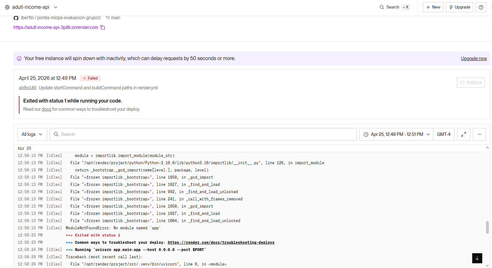
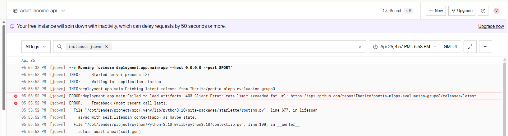
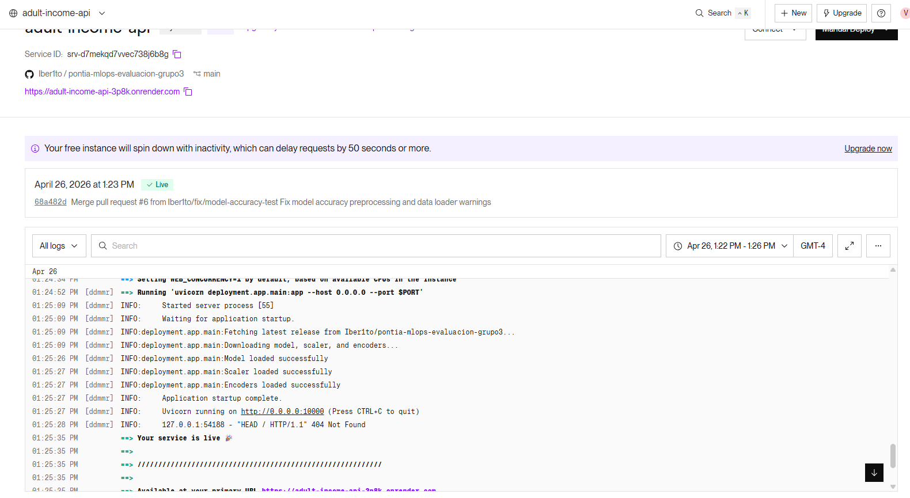

# Issues y problemas encontrados durante el desarrollo

Este documento recoge los principales problemas encontrados durante el desarrollo del proyecto, así como las soluciones aplicadas.

## 1. Required status check no aparecía en GitHub Rulesets

### Problema

Al configurar el ruleset de la rama `main`, GitHub mostraba `No results` al intentar añadir el check obligatorio.

### Causa

El workflow de integración todavía no había generado un status check seleccionable para la rama/PR, o se estaba buscando por el nombre del workflow en lugar del nombre del job.

### Solución

Se ejecutó la pipeline de integración desde un Pull Request y se añadió como required check el job `integrate`.

### Resultado

La rama `main` quedó protegida con:

- Pull Request obligatorio.
- Status check obligatorio.
- Rama actualizada antes de mergear.
- Bloqueo de force push.
- Restricción de borrado.

---

## 2. Cambios build.yml ejecución manual

- Se añade `workflow_dispatch` al workflow de Build Model.
- Se mantiene el trigger automático en push a `main`.
- Se deja el workflow alineado con los requisitos del ejercicio.

### Validación

- El workflow podrá ejecutarse manualmente desde GitHub Actions.
- El build seguirá ejecutándose automáticamente tras merge a `main

---

## 3.Mejora del flujo CD: deploy automático tras build correcto

### Situación inicial

El workflow `Deploy Model` solo se podía ejecutar manualmente mediante `workflow_dispatch`.

### Mejora detectada

Para que el flujo estuviera más alineado con una práctica DevOps, se decidió automatizar el despliegue tras la finalización correcta del workflow `Build Model`.

### Solución aplicada

Se modificó `.github/workflows/deploy.yml` para añadir un trigger `workflow_run` que escucha la finalización del workflow `Build Model` en la rama `main`.

El deploy solo se ejecuta automáticamente si `Build Model` termina con estado `success`.

### Resultado

El flujo queda como:

```text
PR → Integration → Review → Merge a main → Build Model → Deploy Model → Render

```

---

## 4.Error en el test de accuracy del modelo

### Problema

Tras corregir el workflow `Build Model` para ejecutar los tests de modelo con:

```bash
pytest model_tests -v
```

la pipeline falló en el test:

```text
model_tests/test_model.py::test_model_accuracy
```

El error devuelto fue:

```text
ValueError: could not convert string to float: ' Private'
```

### Causa

El test `test_model_accuracy` estaba cargando directamente el archivo `data/raw/adult.test` y enviando los datos al modelo sin aplicar el mismo preprocesamiento utilizado durante el entrenamiento.

El dataset Adult contiene variables categóricas, por ejemplo:

```text
workclass = Private
education = Bachelors
occupation = Adm-clerical
```

El modelo `RandomForestClassifier` no fue entrenado con esos valores en formato texto, sino con datos previamente transformados. Durante el entrenamiento se aplican transformaciones como:

- Codificación de variables categóricas.
- Escalado de características.
- Separación correcta entre variables de entrada y variable objetivo.

Por tanto, el test estaba intentando validar el modelo con datos crudos, mientras que el modelo esperaba datos ya preprocesados.

### Solución aplicada

Se modificó el archivo:

```text
model_tests/test_model.py
```

para que el test use las mismas funciones de carga y preprocesamiento que el pipeline de entrenamiento:

```python
from src.data_loader import load_data, preprocess_data
```

El test de accuracy ahora realiza el siguiente flujo:

```text
1. Carga el modelo entrenado desde models/model.pkl.
2. Carga los datasets adult.data y adult.test.
3. Aplica el preprocesamiento mediante preprocess_data().
4. Ejecuta model.predict() sobre X_test ya transformado.
5. Calcula la accuracy con accuracy_score().
6. Valida que la accuracy sea igual o superior al umbral definido.
```

También se ajustó la configuración de `pytest.ini`, reemplazando una opción incorrecta:

```ini
python_paths = src
```

por una configuración que no de Warning:

```ini
[pytest]
pythonpath = .
```

Esto elimina el warning:

```text
PytestConfigWarning: Unknown config option: python_paths
```

### Código corregido

El codigo queda así:

```python
import sys
from pathlib import Path

import joblib
import numpy as np
import pytest
from sklearn.metrics import accuracy_score

PROJECT_ROOT = Path(__file__).resolve().parent.parent

sys.path.insert(0, str(PROJECT_ROOT))

from src.data_loader import load_data, preprocess_data  # noqa: E402


MODEL_PATH = PROJECT_ROOT / "models" / "model.pkl"
TRAIN_DATA_PATH = PROJECT_ROOT / "data" / "raw" / "adult.data"
TEST_DATA_PATH = PROJECT_ROOT / "data" / "raw" / "adult.test"


def test_model_accuracy():
    model = joblib.load(MODEL_PATH)

    train_df, test_df = load_data(TRAIN_DATA_PATH, TEST_DATA_PATH)
    _, X_test, _, y_test, _, _ = preprocess_data(train_df, test_df)

    predictions = model.predict(X_test)
    accuracy = accuracy_score(y_test, predictions)

    assert accuracy >= 0.80, f"Model accuracy below expected threshold: {accuracy:.2f}"
```

### Validación local

Antes de subir la corrección se validó localmente con:

```bash
python src/main.py
pytest model_tests -v
pytest -v
```

### Resultado

El test dejó de fallar por datos  sin transformar y ahora valida el modelo de forma coherente con el pipeline real de entrenamiento.

La corrección mejora el workflow `Build Model`.

---

## 5.Errores en el despliegue en Render

### 5.1 Discrepancia en las rutas de configuración

### Problema 
Error de ejecución en el entorno de producción: ModuleNotFoundError: No module named 'app'. El servicio falló durante la fase de inicialización (bootstrapping).



### Causa 
El archivo de orquestación render.yml contenía rutas relativas incorrectas para los comandos de construcción e inicio. No se estaba considerando el directorio raíz deployment/, donde se encuentran alojados tanto el archivo de dependencias (requirements.txt) como el punto de entrada de la aplicación (main.py).

#### Configuración errónea inicial

```text
buildCommand: "pip install --upgrade pip && pip install -r requirements.txt"
startCommand: "uvicorn app.main:app --host 0.0.0.0 --port $PORT"
```

### Solución
Se normalizaron las rutas en el archivo render.yml para reflejar la estructura jerárquica del repositorio.

#### Configuración corregida

```text
buildCommand: "pip install --upgrade pip && pip install -r deployment/requirements.txt"
startCommand: "uvicorn deployment.app.main:app --host 0.0.0.0 --port $PORT"
```
### 5.2 Limitaciones en la API de GitHub

### Problema 
Fallo crítico durante la descarga de artefactos de Machine Learning. Mensaje de error en logs: "requests.exceptions.HTTPError: 403 Client Error: rate limit exceeded".



### Causa
La lógica de la aplicación realiza peticiones no autenticadas a la API de GitHub para obtener la última versión del modelo entrenado. GitHub impone un límite estricto de 60 solicitudes por hora para direcciones IP compartidas (como las de los nodos de construcción de Render), el cual fue excedido debido a múltiples intentos de despliegue consecutivos.

### Solución

Se implementó una estrategia de espera técnica para permitir el restablecimiento de la cuota de la API por parte de GitHub. El despliegue se reintentó tras un intervalo de tiempo, logrando un despliegue exitoso. Como mejora futura, se recomienda el uso de un GitHub Token de solo lectura para evitar limitaciones por IP.




